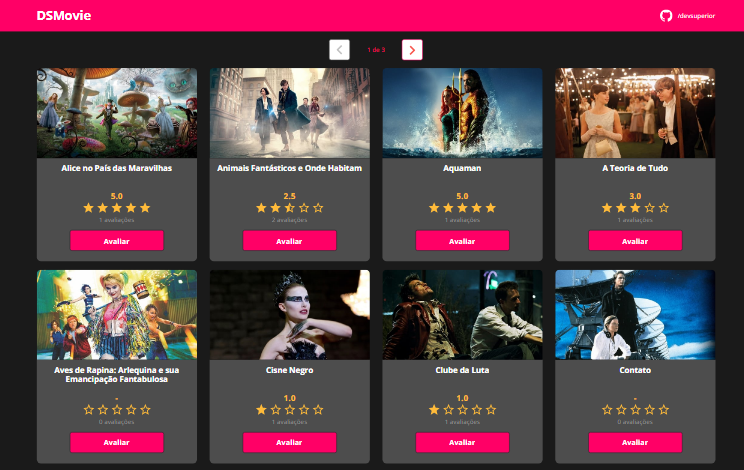

<h2> </h2>

Projeto realizado durante o evento "Semana Spring React" oferecido pelo canal DevSuperior. Com o objetivo de desenvolver um website de avaliações de filmes utilizando Java com Spring Boot no back end, TypeScript com ReactJS no front end.

     

#### Tecnologias utilizadas:

     
      
     
      
     

